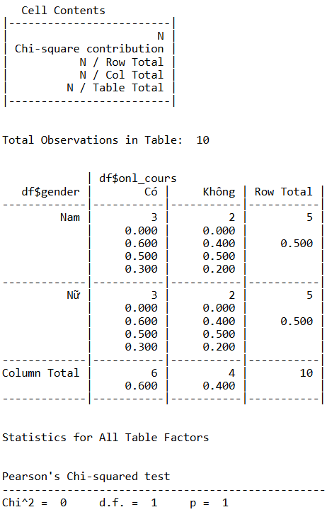
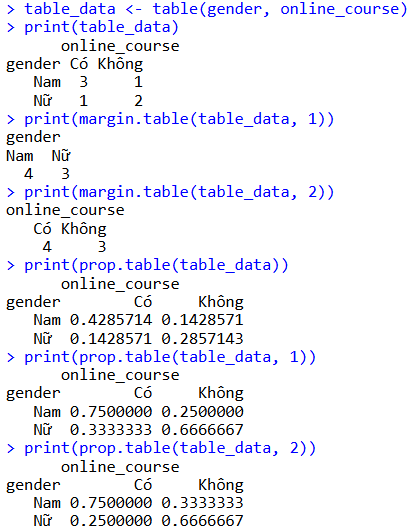
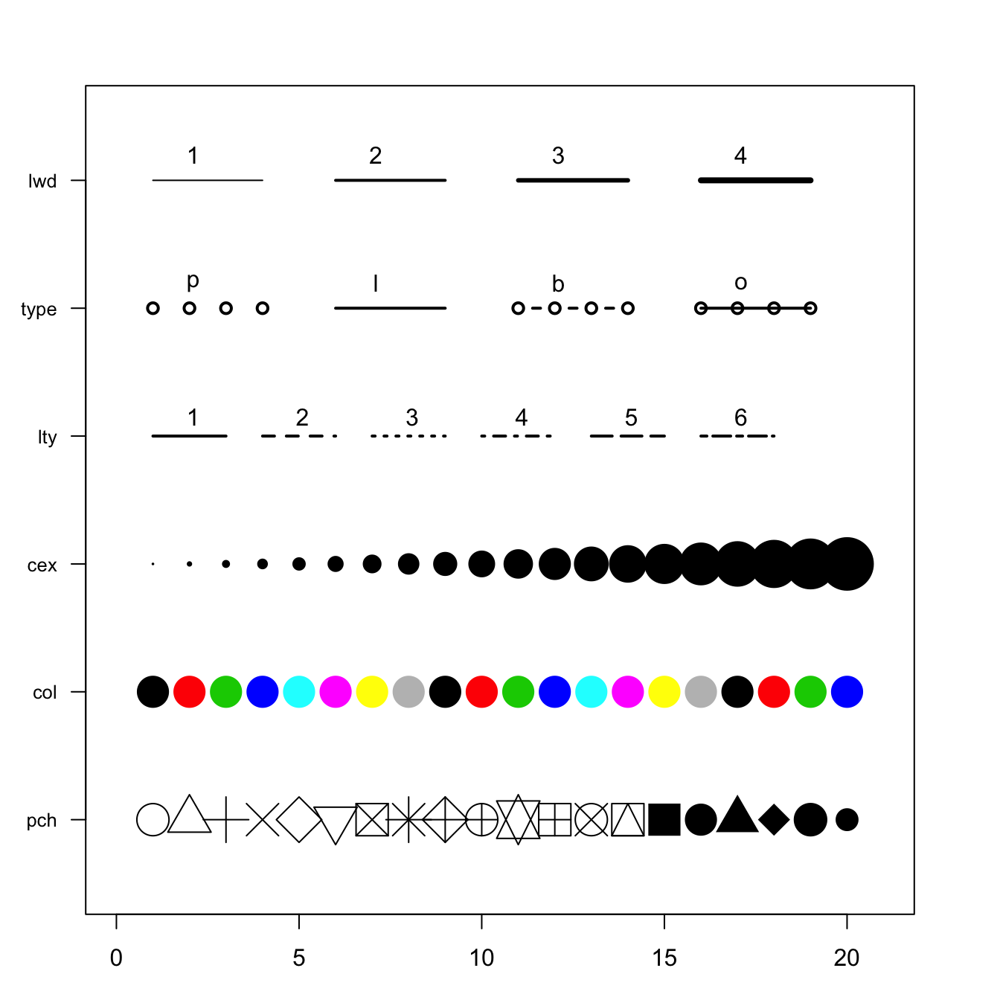
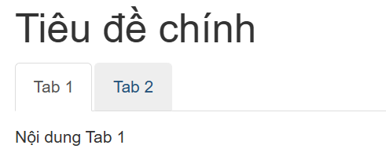

# R - The basic concepts
## Some simple function terms 
```ruby
q() # quit console
help.start() # starter documentation

# specific document about that args
help("<fun>") 
?<fun>

args("<fun>") # display arguments and default parameters
apropos("<chars>") # return all func included in string

# working dir manupulations
setwd("<dir>") 
getwd()

install.packages("<NAME>") # install packages

# divert/save output to somewhere else
sink("<file_name>") # start sinking
...
sink() # stop sinking
```
## Data type
- Variable types: logical, integer, double, complex, char, raw
- Some data types:
	- Vector: continuous cells hold datas ([]), array start with 1, create through `c(1,2,3)`
	- Factor:  represent categorical data (literally map in other language)
	- List: set of data types (use `list()` and `$` to access specific data variable)
	- Data frame:
	- Function
	- Matrix: create through `c(<dim1_size>,<dim2_size>,...)`
```ruby
-------------------------------
# matrix type
x <- 1:12 ; dim(x) <- c(3,4)
x

#output
=begin
     [,1] [,2] [,3] [,4]
[1,]    1    4    7   10
[2,]    2    5    8   11
[3,]    3    6    9   12
=end
-------------------------------
# data frame type
students <- data.frame(
  Name = c("Alice", "Bob", "Charlie", "David"),
  Age = c(23, 25, 22, 24),
  Grade = c("A", "B", "A", "C"),
  Passed = c(TRUE, TRUE, TRUE, FALSE)
)
# Access the 'Name' column
print(students$Name)
# Students who passed
passed_students <- students[students$Passed == TRUE, ]
# Summary statistics for the data frame
summary(students)
-------------------------------
# List type
my_list <- list( 
	numeric_vector = c(1, 2, 3), 
	character_vector = c("apple", "banana"), 
	data_frame = data.frame( 
		Name = c("Alice", "Bob"), 
		Age = c(25, 30) ) ) 
# Access the data frame 
print(my_list$data_frame)
-------------------------------

```
## Setup:
```r
var <- "some data types"
var2 <- c(1,2,3)
var3 <- list()
var4 <- edit(var4) # get user input for var4
var5 <- read.table("<file_name>", header = TRUE/FALSE) # read txt file
var6 <- read.csv("<file_name>", header = TRUE/FALSE) # read csv
attach(var5) # break data frame to separate colunm that could be callable 
```
## Some function with data frame:
- Data frame core functions:
```r
dim() # see numbers of objects and columns
head() # 6 first objects
tail() # 6 last objects
str()  # describe each column
edit() # edit data frame
View() # see data frame as grid view
nrow() # take number of columns in data frame
colnames(var[n]) # get name of n-th columns
```
## Dirty check:
```r
na.fail(var) # check if data has NA, if yes, stop executing
na.omit(var) # remove NA records
na.pass(var) # don't care if is NA or not, just print out
```
## Data manupilation
```r
# subset
data <- data.frame(x = 1:10, y = 11:20)
subset(data, x > 5)  # Chọn các hàng với x > 5

# merge - như JOINT trong SQL
df1 <- data.frame(id = 1:3, x = c("A", "B", "C"))
df2 <- data.frame(id = 2:4, y = c("D", "E", "F"))
merge(df1, df2, by = "id")  # Kết hợp df1 và df2 theo cột 'id'

# rbind()
df1 <- data.frame(x = 1:2, y = 3:4)
df2 <- data.frame(x = 5:6, y = 7:8)
rbind(df1, df2)  # Nối df1 và df2 theo hàng

# cbind()
x <- 1:3
y <- 4:6
cbind(x, y)  # Nối x và y theo cột

# replace
x <- c(1, 2, 3, 2, 1)
replace(x, x == 2, 99)  # Thay giá trị 2 thành 99

# factor
x <- c("low", "medium", "high", "low")
factor(x)  # Chuyển x thành biến phân loại

# cut()
x <- c(1, 5, 10, 15)
cut(x, breaks = 3)  # Chia x thành 3 nhóm (bins, by depth)
cut2(x, g = 2) # bins (by width), using Hmisc library

# sequece
seq(1, 10, by = 2)  # Dãy số từ 1 đến 10, mỗi bước cách 2

# replica
rep(1:3, times = 2)  # Lặp lại 1:3 hai lần

# gl(): Tạo biến phân loại theo mức (levels) và số lần lặp.
gl(3, 2, labels = c("A", "B", "C"))  # Tạo biến phân loại có 3 mức, mỗi mức lặp 2 lần
```
# Basic analyst and Graph
- `summary(data)` để lấy toàn bộ thông số cơ bản cở data frame
- `min/max(data[X])` find min/max by columns X  
- `unique(columns/data/...)` trả về set của bộ data đó
- `by(data, INDICES, FUN, ...)`: nhóm các dữ liệu theo INDICES (là nhóm sau khi được uniqued), sau đó tìm toàn bộ indices có data rồi apply FUNction lên nó (`...` là các tham số truyền thêm vào FUN)
## Thống kê biến liên tục 
- Package: `psych`
- `describe(df)` Thống kê cho các cột dữ liệu.
- `describeBy(df, group=các dữ liệu phân nhóm)` Thực hiện thống kê theo các nhóm khác nhau.
## Thống kê biến rời rạc
- `CrossTable(x, y, data=df, digits=2, chisq=TRUE)` đưa ra bảng 2 chiều thể hiện 2 bộ biến x, y, ngoài ra có thể kiểm tra 2 bộ giá trị x, y có phụ thuộc nhau không thông qua các kiểm định (Chi-square, Fisher, ...)
## Thống kê theo tần số 
- Sử dụng `table(x, y)=tb`, tạo các bảng 1/2 chiều
- `margin.table(tb,1/2/3/...)` xem bảng theo các mức (2 chiều thì có 2 mức, lệnh sẽ trả về bảng 1 chiều theo mức chỉ định)
- `prop.table(tb)`: trả về bảng đó nhưng là xác suất thay vì tần suất
## Graph
- `par(mfrow = c(<rows>,<cols>)`: create a window with rows x cols for ready to draw plot
- Graph parameters:
	- `type`: Xác định cách vẽ ("p", "l", "b", "c", "o", "h", "s", "S", "n").
	- `main`: Tiêu đề đồ thị.
	- `sub`: Tiêu đề phụ.
	- `xlab`: Nhãn trục x.
	- `ylab`: Nhãn trục y.
	- `asp`: Tỉ lệ khung hình y/x.
	- `lty`: Kiểu đường, có thể là số nguyên (0, 1, 2, 3, 4, 5, 6) hoặc chuỗi ("blank", "solid", "dashed", "dotted", "dotdash", "longdash", "twodash").
	- `pch`: Kiểu điểm.
	- `col`: Màu sắc, ví dụ: "red", "blue", "green", "orange", "yellow", "cyan",…
	- `bty`: Kiểu khung, có thể là: "n", "o", "c", "l", "7".

- Legend:
	- `legend(x, y, legend, col, pch, lty, ...)`: tạo chú thích trong đồ thị 
	- `mtext(text, side, line, cex, col, ...)`: tạo chú thích ngoài đồ thị 
	- `text(x, y, labels, cex, col, font, ...)`: vị trí cụ thể trong đồ thị
- `plot(x,y)`: vẽ đồ thị với 2 trục x, y cơ bản
- `hist` : vẽ đồ thị phổ/xác xuất
	- Kết hợp với đồ thị đường thể hiện mật độ lines và hàm density (chú ý hàm hist cần phải đặt thông số prob=T)
- `lines`: vẽ đồ thị đường
- `pie`: vẽ đồ thị hình tròn
- `boxplot(x|x~y,...)` : vẽ đồ thị hộp
- `barplot` : vẽ đồ thị hình khối
- `Stars` : vẽ đồ thị hình sao/mạng nhện/radar
- `qqnorm` : vẽ phân phối quantile quanh biến số x
- `qqplot` : vẽ phân phối theo quantile theo 2 biến
- `qqline` : vẽ đường quantile
- `abline` : vẽ đường thẳng với intercept, slope; đường ngang; đường đứng; theo mô hình hồi quy tuyến tính
- `scatterplot(y~x|group,...)` (gói `car`)
![[Graph Type in R.excalidraw|700]]
## Kiểm định data
- Quần thể: poppulation, mẫu: sample
- `shapiro.test`: kiểm tra xem data có PPC không -> P-value < 0,05: không PPC, bác bỏ giả định 
	- Kiểm định thông qua biểu đồ: `qqnorm`, `qqline`.
	- Các kiểm định khác (gói `nortest`): `ad.test(x)`, `lillie.test(x)`
- `<mode>norm(...)`: hàm mô phỏng xác suất với các mode:
	- `rnorm(n, mean, sd)`: tạo ra một mẫu ngẫu nhiên từ phân phối chuẩn
			- `n`: số lượng mẫu
			- `mean`: kỳ vọng (TB mẫu)
			- `sd`: độ lệch chuẩn
	- `dnorm(x, mean, sd)` tính mật độ xác suất tại một giá trị `x` cho phân phối chuẩn.
	- `pnorm(q, mean, sd)`: tính xác suất tích lũy (P(X ≤ `q`)) của phân phối chuẩn.
	- `qnorm(p, mean, sd)` tìm giá trị tương ứng với một xác suất tích lũy P(X <= x) = `p`
- **Kiểm định t một mẫu**: Kiểm tra xem mẫu có đại diện cho quần thể hay không. 
	- Sử dụng hàm `t.test(x, mu=value)`. 
	- `mu`: mean của quần thể. 
- Kiểm định t cho 2 mẫu: Kiểm tra sự khác biệt giữa 2 mẫu. 
	- Hàm `t.test(x ~ y, data=df)`. 
	- `y`: biến phân lớp (2 giá trị). 
	- Kết quả trả về bậc tự do (df), p-value, t, khoảng tin cậy 95%. 
	- Chú ý: Đối với dữ liệu là 2 cột/vector, có thể dùng hàm dạng `t.test(x, y)`
- Biên tập dữ liệu – Chuyển cột/hàng: 
	- Sử dụng hàm `melt`, `cast` trong gói `reshape2`. 
	- Chuyển từ cột thành dòng: `melt(df, id.vars="x, y, ...", measure.vars="x, y, ...") `
		- `id.vars`: list các cột giữ nguyên (khóa định danh)
		- `measure.vars`: list cột cần chuyển
	- Chuyển từ dòng thành cột: `cast(df, id.vars="x, y, ...")`
- Kiểm định phương sai: 
	- Hàm `var.test(x ~ y, data=df)`: Kiểm tra sự khác biệt phương sai giữa 2 nhóm. 
	- Chú ý: Đối với dữ liệu là 2 cột/vector, có thể dùng hàm dạng `var.test(x, y)`. 
- Kiểm định Wilcoxon: kiểm định phi tham số, được sử dụng cho dữ liệu không theo phân phối chuẩn, nếu p-value > 0.05 thì sự khác biệt của hai mẫu không có ý nghĩa thống kê. 
	- Hàm `wilcox.test(x ~ y)` hoặc `wilcox.test(x, y)` 
- Kiểm định t và Wilcoxon cho cặp: Thường được sử dụng cho các phân tích dữ liệu được theo dõi theo thời gian. (Ví dụ: Kiểm định dữ liệu điểm thi lần 1 và lần 2 cho các sinh viên)
	- Dữ liệu không phải là các biến độc lập nhau. 
	- Sử dụng các hàm tương tự như trước, với tham số `paired=TRUE`. 
# Regression Analysis
## Linear
- **Mục đích:** mô hình hóa mối quan hệ giữa các biến xem có AH đến nhau không?
- **Ứng dụng:** Dự báo các giá trị tương lai dựa vào giá trị của các biến độc lập.
- **Các loại:**
    - **Hồi quy đơn biến (hồi quy đơn):** check if phụ thuộc **một** biến độc lập. $$y = a x + b$$
		- Cú pháp trong R: `lm(y~x)`: 
			- Return `intercept ~ b` và `a * x`
    - **Hồi quy đa biến (hồi quy bội):** check if phụ thuộc **nhiều** biến độc lập.$$y = a_1 x_1 + a_2 x_2 + \cdots + a_n x_n + b$$
	    - Cú pháp: `lm(y~x1 + x2...)`
    - **Hồi quy đa thức:** Sử dụng phương trình đa thức để mô hình hóa mối quan hệ phi tuyến tính giữa biến phụ thuộc và biến độc lập. $$y = a_n x^n + a_{n-1} x^{n-1} + \cdots + a_2 x^2 + a_1 x + b$$
	    - Cú pháp: `lm(y ~ poly(x,n))` (y biến phụ thuộc, x độc lập, n là bậc)
### Hệ số Tương quan
- **Mục đích:** Đo lường mức độ tương quan tuyến tính giữa hai biến.
- **Giá trị:** Dao động từ -1 đến 1.
    - r ≈ 0: Hai biến không có liên hệ tuyến tính.
    - r ≈ 1 hoặc -1: Hai biến có mối liên hệ tuyến tính tuyệt đối (tăng giảm cùng/ngược chiều).
- **Các loại:**
    - **Pearson:** Dùng cho biến tuân theo phân phối chuẩn. `cor(x,y)` hoặc `cor.test(x.y)`
    - **Spearman:** Phương pháp phi tham số, không yêu cầu phân phối chuẩn. `cor.test(x,y,method=‘spearman’)`
    - **Kendall:** Phương pháp phi tham số, tính toán dựa trên cặp số song hành. `cor.test(x,y,method=‘kendall’)`
### Kiểm tra Giả định và Dự báo
- **Kiểm tra giả định:** Phân tích phần dư (residuals) bằng cách vẽ biểu đồ.
- `predict(object, newdata, ...)`
### Lựa chọn Biến cho Mô hình Hồi quy
- **Thủ công:** Quan sát đồ thị hoặc tính toán hệ số tương quan giữa các biến.
- **Tự động:** Sử dụng tiêu chuẩn thông tin AIC (Akaike Information Criterion) để lựa chọn mô hình tối ưu.
    - Hàm `step()` với các hướng "both", "backward", "forward".
- **BMA (Bayesian Model Averaging):** Tìm kiếm tất cả mô hình dựa trên các biến và tiêu chuẩn AIC.
    - `library(BMA)`
    - `bicreg()`
## Logistic
- **Mục đích:** Dự đoán xác suất của một sự kiện nhị phân (có/không) dựa trên các biến độc lập.
- **Ứng dụng:** Dự đoán khả năng khách hàng sử dụng dịch vụ, mua hàng, phân loại spam mail, đánh giá khả năng trả nợ...
- **Công thức:** Sử dụng hàm sigmoid để tính toán xác suất.
- **Thực hiện trong R:** Sử dụng hàm `glm()` với `family='binomial'`.
- **Chọn mô hình tối ưu:** Tương tự như hồi quy tuyến tính, có thể sử dụng AIC hoặc BMA.
# Hierarchical Analyst (Dendrogram)
### Phân cụm dữ liệu
#### Phân cụm bằng phương pháp phân cấp (Hierarchical Clustering)
- **Mục đích:** Tạo ra một biểu đồ phân cấp (dendrogram) thể hiện mối quan hệ giữa các đối tượng.
- **Các bước thực hiện:**
    - **Tính khoảng cách giữa các đối tượng:** 
        - `dist(df, method="")` với các method: `euclidean`,`maximum`, `manhattan`, `canberra`, `binary`, `minkowski`
    - **Phân cụm:** Sử dụng hàm `hclust()` với đầu vào là ma trận khoảng cách.
    - **Vẽ đồ thị dendrogram:** Sử dụng hàm `plot()` hoặc các gói chuyên dụng như `ggdendro`, `ape`, `dendextend` để vẽ đồ thị đẹp hơn.
#### Phân cụm bằng phương pháp K-Means
- **Mục đích:** Phân chia n đối tượng vào k nhóm (cụm) sao cho khoảng cách giữa các đối tượng trong cùng một nhóm là nhỏ nhất, và khoảng cách giữa các nhóm là lớn nhất.
- **Thực hiện:** Sử dụng hàm `kmeans(x, centers, ...)` với các tham số:
	- Bộ dữ liệu (các cột phải là số).
	- Số cụm (k): `centers=k.
	- Thuật toán phân cụm (tùy chọn).
- **Kết quả:** Hàm `kmeans()` trả về:
    - Vector phân cụm tương ứng cho các đối tượng (`$cluster`).
    - Tâm của các cụm (`centers`).
- **Thuật toán PAM:** Có thể sử dụng thuật toán PAM để phân cụm bằng cách sử dụng gói `cluster` và hàm `pam()`.
#### Xác định số cụm (k)
- **Dựa trên kinh nghiệm:** Số cụm k có thể được xác định dựa trên ý kiến chuyên gia.
- **Sử dụng phương pháp thống kê:** Có nhiều phương pháp đề xuất để xác định k, trong đó 3 phương pháp phổ biến là:
    - **Elbow:**
    - **Average silhouette:**
    - **Gap statistical:**
- **Gói hỗ trợ:** `factoextra`, `NbClust` cung cấp các hàm để xác định số cụm tối ưu.
- **Hàm `fviz_nbclust(df, kmeans, method="")`:** với các method `wss`, `silhouette`, `gap_stat` để xác định k.
- **Hàm `fviz_cluster(object, data= ,ellipse= )`:** Sử dụng để vẽ biểu đồ cụm với các tùy chọn như vẽ vòng ellipse quanh cụm.
- `hcut(data, k= )`: Phân cụm phân cấp.
- `fviz_dend(kmeans_obj)`: Vẽ dendrogram.
- `fviz_silhouette(kmeans_obj)`: Vẽ biểu đồ silhouette.
- `eclust()`: Phân cụm với nhiều phương pháp khác nhau.
### Phân tích dữ liệu tài chính bằng gói quantmod
- **quantmod:** Gói R viết tắt của "Quantitative Financial Modelling & Trading", cung cấp các công cụ để phân tích dữ liệu tài chính theo chuỗi thời gian.
- **Nguồn dữ liệu:** Cho phép tải xuống hơn 40.000 bộ dữ liệu chuỗi thời gian từ các nguồn như Yahoo Finance, Google, FRED.
- **Định dạng dữ liệu:** Dữ liệu cần tuân thủ định dạng chuẩn để các hàm có thể đọc được.
- **Lấy giá cổ phiếu:**
    - Hàm `getSymbols()` với các tham số:
        - `Symbols="<NAME>"`
        - `src="yahoo"`
        - `from="...", to="..."`
- **Vẽ đồ thị:**
    - `chartSeries(<NAME>)`: Vẽ biểu đồ chuỗi thời gian.
    - `barChart(<NAME>)`: Vẽ biểu đồ dạng cột.
    - `candleChart(<NAME>)`: Vẽ biểu đồ dạng nến Nhật.
    - `addMACD()`: Thêm chỉ báo MACD vào biểu đồ.
    - `addBBands()`: Thêm dải Bollinger Bands vào biểu đồ.
- **Tỷ giá:** `getFX("EUR/USD",from="...")`
- **Giá kim loại quý:** `getMetals(Metals = "gold", base.currency = "USD", from = "...")`.
# The R Markdown
- Form a structure of:
	- YAML: metadata for the report
		- `key: value` format (JSON)
	- Code chunk: chunks of code that is pure code waiting for running, specs by 1 or 3 backticks `{r NAME option1=value1, option2=value2}`, execute ngay khi knit
		- `eval=FALSE`: Do not run the snippet
		- `echo=FALSE` No source code is displayed in the output.
		- `warning=FALSE`: ignore errors
		- `message=FALSE`: ignore messages
		- `include=TRUE/FALSE`: hiển thị cả codechunk với output ko?
		- `out.width / out.height = "75%"`: set width/height cho output
		- `fig.align = "center"` để align pictures center
		- **`fig.show`:** Control how multiple charts are displayed:
			- `'hold'`: Displays multiple charts on the same line.
			- `'asis'`: Displays each chart immediately after the code that generates them.
			- `'hide'`: Hide charts.
			- `'animate'`: Combine charts into one animation (supported in HTML only).
	- Markdown text: literally pure obsidian
		- Sử dụng `*` tạo đầu mục, `space` 2 lần để lùi vào 1 tầng
		- Sử dụng `<!-- -->` để comment (`Ctrl+Shift+C`)
		- `Ctrl+Alt+I` fast code chunk
- Sử dụng `{.tabset}` để tạo tab có thể tương tác, **mỗi đầu mục phải cách ra 1 dòng**
```rmd
# Tiêu đề chính {.tabset}

## Tab 1
Nội dung Tab 1

## Tab 2
Nội dung Tab 2
```


- Flexdashboard: tạo dashboard có tính tương tác cao trong report
	- Các đầu mục `#` tạo ra các trang, `##` tạo cột/hàng theo `orientation`
```yaml
---
output: 
  flexdashboard::flex_dashboard:
    orientation: rows/columns
    vertical_layout: fill/scroll
---

# Trang 1 {data-navmenu="Nhóm A"}

## Cột 1 {data-width=300}
Nội dung của Cột 1.

## Cột 2
Nội dung của Cột 2.

---

# Trang 2 {data-navmenu="Nhóm A"}

## Thanh bên {.sidebar}
Đây là nội dung của thanh bên cho trang 2

## Nội dung chính
Đây là nội dung chính của dashboard.

---

# Phân tích Dữ liệu {data-navmenu="Báo cáo"}

## Tổng quan
Nội dung phần tổng quan.

---

# Kết quả {data-navmenu="Báo cáo"}

## Chi tiết
Nội dung chi tiết.
```
